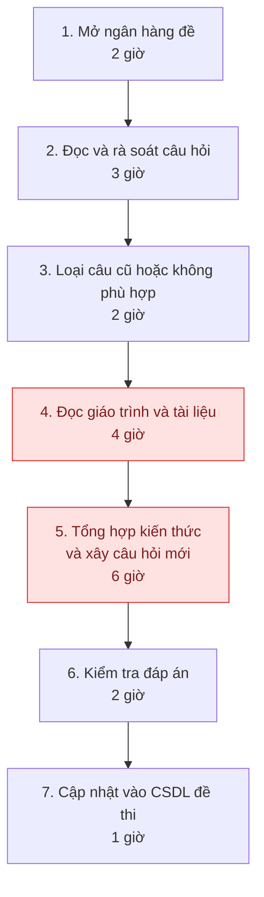
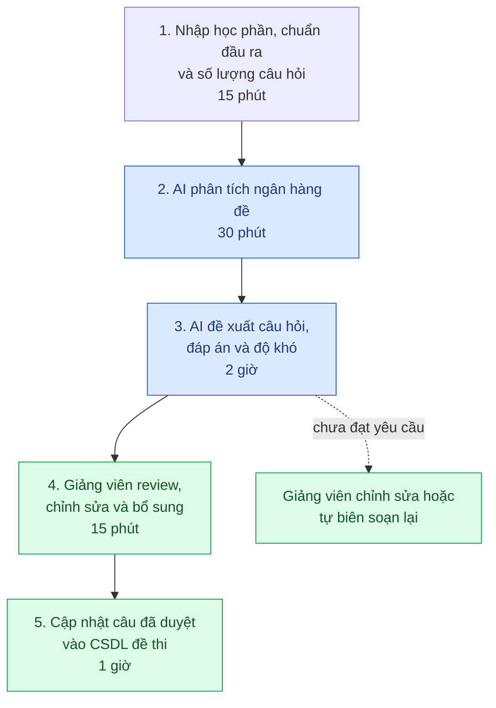

# Group Report — Day 02

## Thành viên nhóm A-4

| STT | Họ và tên | Mã học viên | Vai trò trong nhóm |
|-----|-----------|-------------|--------------------|
| 1 | Thái Hoài An | 2A202601862 | Researcher |
| 2 | Nguyễn Văn Sáng | 2A202601252 | Workflow, phân tích problem và hiện trạng |
| 3 | Dương Ngọc Hải | 2A202601748 | Đề xuất giải pháp |
| 4 | Trương Ngọc Hải | 2A202601902 | Soạn slide, tổng hợp nội dung |
| 5 | Đặng Văn Nhân | 2A202601050 | Leader |

---

# Phase 3 — Group Convergence

## Trình bày candidates

| # | Người đưa ra | Candidate problem | Người gặp vấn đề | Điểm nghẽn | Cảm nhận nhanh |
|---|---|---|---|---|---|
| 1 | Thái Hoài An | Phát hiện task phụ thuộc và chia việc không cân bằng | Thành viên nhóm dự án | Task rải rác, blocker lộ muộn, việc dồn vào một người | Workflow rõ, dễ thử với task board |
| 2 | Trương Ngọc Hải | Agent tìm học bổng phù hợp | Sinh viên chuẩn bị học tiếp | Thông tin phân tán, khó so sánh điều kiện và hạn nộp | Có ích nhưng dữ liệu thay đổi liên tục |
| 3 | Dương Ngọc Hải | Camera CV phát hiện gian lận thi cử | Giám thị, nhà trường | Theo dõi nhiều thí sinh và xác minh hành vi đáng ngờ | Impact cao nhưng nhạy cảm và khó làm trong lab |
| 4 | Nguyễn Văn Sáng | Tạo giáo án | Giáo viên | Tìm tài liệu, thiết kế nội dung và bài tập cho từng lớp | Pain rõ, nhưng cần kiểm chất lượng theo môn/lớp |
| 5 | Đặng Văn Nhân | Xây dựng và cập nhật ngân hàng đề thi | Giảng viên | Rà câu cũ, đọc giáo trình, kiểm đáp án và tránh trùng đề | Có workflow rõ, nhóm đã có quan sát ban đầu |

## Gom trùng / cluster

| Cluster | Candidates included | Pattern chung | Ghi chú |
|---|---|---|---|
| Hỗ trợ công việc giảng dạy | Tạo giáo án, ngân hàng đề thi | Người dạy đọc tài liệu, tạo nội dung và phải kiểm lại chất lượng | Hai bài cùng domain nhưng ngân hàng đề có vấn đề trùng câu cụ thể hơn |
| Tìm và điều phối thông tin | Task phụ thuộc, tìm học bổng | Nhiều nguồn thông tin, cần tổng hợp và ưu tiên | Học bổng phụ thuộc dữ liệu web mới; task phụ thuộc cần dữ liệu task board đủ rõ |
| Giám sát thi cử | Camera CV phát hiện gian lận | Phát hiện hành vi bất thường từ video | Có rủi ro riêng tư, sai nhầm và yêu cầu kỹ thuật cao |

## Shortlist

| Candidate | Vì sao vào shortlist | Rủi ro / điều chưa rõ |
|---|---|---|
| Phát hiện task phụ thuộc và chia việc không cân bằng | Workflow và actor rõ, có thể vẽ before/after | Cần task board có owner, deadline và trạng thái đủ đầy |
| Tạo giáo án | Tốn thời gian, AI có thể tạo bản nháp từ tài liệu | Chất lượng phụ thuộc môn học, trình độ lớp và chuẩn đầu ra |
| Cập nhật ngân hàng đề thi | Có quy trình rõ, có tín hiệu về câu trùng giữa các năm, có thể đo thời gian review và số câu bị gắn cờ | Cần xác định tiêu chí “quá giống”, quyền dùng giáo trình/ngân hàng đề và baseline thật |

## Score để đồng thuận

| Candidate | Actor rõ | Workflow rõ | Pain có evidence | Impact đo được | Làm trong lab | So sánh R/W/A được | Nhóm hiểu domain | Tổng |
|---|---:|---:|---:|---:|---:|---:|---:|---:|
| Task phụ thuộc và chia việc không cân bằng | 4 | 4 | 3 | 4 | 5 | 4 | 4 | 28 |
| Agent tìm học bổng | 4 | 4 | 3 | 4 | 3 | 4 | 4 | 26 |
| Camera CV phát hiện gian lận | 4 | 3 | 3 | 5 | 1 | 3 | 2 | 21 |
| Tạo giáo án | 5 | 5 | 4 | 5 | 4 | 4 | 4 | 31 |
| Cập nhật ngân hàng đề thi | 5 | 5 | 4 | 5 | 4 | 5 | 5 | 33 |

Candidate nhóm chọn:

```text
Xây dựng và cập nhật ngân hàng đề thi từ giáo trình/tài liệu môn học.
```

Vì sao chọn:

```text
Nhóm hiểu workflow, actor và bottleneck. Quan sát ban đầu cũng cho thấy việc rà câu cũ,
đối chiếu giáo trình và kiểm đáp án mất nhiều công; câu hỏi trùng giữa các năm là một tín hiệu cần xử lý.
Scope có thể thu nhỏ để thử trên một chương và một loại câu hỏi.
```

Vì sao không chọn các candidate còn lại:

```text
Task phụ thuộc: dễ làm nhưng nhóm chưa có evidence đủ mạnh ngoài trải nghiệm cá nhân.
Agent tìm học bổng: nguồn thay đổi liên tục, dễ sai hạn/điều kiện và scope agent khá rộng.
Camera CV: liên quan quyền riêng tư, sai nhầm và cần dữ liệu/video vượt quá thời gian lab.
Tạo giáo án: gần với ngân hàng đề nhưng chất lượng giáo án phụ thuộc rất nhiều vào từng lớp;
non-AI như giáo án mẫu hoặc tái sử dụng giáo án cũ có thể giải quyết một phần lớn pain.
```

Nếu có disagreement, nhóm xử lý thế nào:

```text
Nhóm không chọn theo ý tưởng “ngầu” nhất. Mỗi người chấm theo cùng tiêu chí,
sau đó so workflow, evidence và scope. Nhóm chọn ngân hàng đề vì điểm cao nhất
và vẫn giữ các idea còn lại làm phương án dự phòng.
```
# Phase 4 — Quick Validation + Research giải pháp
## Quick validation

Nhóm hỏi nhanh 2 giảng viên có trực tiếp ra đề và quan sát một lần cập nhật ngân hàng câu hỏi cho một học phần. Ghi nhận này dùng để kiểm tra hướng problem, không thay cho khảo sát quy mô lớn.

| Nguồn | Số người | Tín hiệu xác nhận | Tín hiệu phản bác | Nhóm sửa problem thế nào |
|---|---:|---|---|---|
| Quick interview | 2 | Cả 2 giảng viên vẫn rà câu cũ, đọc lại tài liệu và kiểm đáp án thủ công; phần đọc/rà tốn công nhất. Có ghi nhận câu hỏi cũ bị dùng lại qua các năm | Thời gian và mức lặp thay đổi theo môn, quy mô ngân hàng và kỳ thi | Thu hẹp problem vào rà câu cũ, phát hiện câu tương tự và tạo bản nháp, không hứa tự động hóa toàn bộ |
| Quan sát workflow | 1 lần | Người quan sát thấy việc mở ngân hàng, đối chiếu giáo trình, soạn câu và kiểm đáp án diễn ra tuần tự; có nhiều thao tác đọc lặp lại | Chỉ quan sát một học phần nên chưa đại diện cho mọi môn | Pilot chỉ thử trên 1 chương và 1 loại câu hỏi |
| Thảo luận nhóm | Toàn nhóm | Các thành viên cùng xác nhận đề có câu trùng giữa các năm; điều này có thể khiến điểm số phản ánh việc nhớ đề cũ hơn là mức độ hiểu kiến thức | Chưa có số liệu về tỷ lệ trùng câu và ảnh hưởng tới điểm số | Thêm tiêu chí pilot: AI phải gắn cờ câu mới có nội dung quá giống câu đã có, giảng viên quyết định giữ/sửa/bỏ |

Insight sau validation:

```text
Pain không chỉ là “tạo thật nhiều câu hỏi”.
Pain nằm ở việc rà câu cũ, đối chiếu giáo trình, kiểm đáp án và tránh dùng lại câu hỏi quá giống đề các năm trước.
Nếu đề lặp, kết quả thi có thể phản ánh việc nhớ đề cũ nhiều hơn mức độ hiểu kiến thức.
```

## Research giải pháp

Nhóm tìm các hướng đã có sẵn, không giả định phải tự xây cả LMS hoặc cả ngân hàng câu hỏi từ đầu.

| Nguồn / tool / case | Link | Họ giải quyết phần nào? | Điểm mạnh | Khoảng trống / rủi ro | Bài học cho nhóm |
|---|---|---|---|---|---|
| Moodle Question Bank | [Moodle: Building Quiz](https://docs.moodle.org/501/en/Building_Quiz) | Lưu, tìm, tag và chọn câu hỏi từ question bank | Hỗ trợ tổ chức và tái sử dụng câu hỏi | Không tự đọc giáo trình hay đánh giá chất lượng câu | Cần chuẩn hóa metadata: môn, chương, CLO, mức độ khó, năm dùng |
| Kahoot! AI | [Kahoot!: generate a kahoot with AI](https://support.kahoot.com/hc/en-us/articles/40803785990675-How-to-generate-a-kahoot-with-AI) | Tạo quiz từ topic, PDF, URL hoặc slide | Có thể chọn độ khó, số câu và sửa câu trước khi lưu | Chủ yếu phù hợp quiz/knowledge check; nhà cung cấp cũng yêu cầu người dùng review độ chính xác | Pattern phù hợp: giáo trình là nguồn đầu vào, AI tạo draft, giảng viên chọn/sửa câu |
| Wayground (Quizizz) AI | [Wayground: generate assessments from documents](https://support.quizizz.com/hc/en-us/articles/21615394077337-Quizizz-AI-Create-Assessments-from-Documents-Images-More) | Tạo assessment từ tài liệu, prompt, website, video hoặc ảnh | Có thể sửa loại câu hỏi, đáp án và nội dung trước khi publish | Có giới hạn xử lý tài liệu; AI có thể sinh kết quả không chính xác | Pilot cần đo chất lượng câu sau review, không chỉ đo số câu tạo ra |
| QuestionWell | [QuestionWell features](https://questionwell.org/features) | Tạo bộ câu hỏi từ văn bản, rút learning outcomes và export sang nhiều nền tảng | Tập trung vào tạo và xuất question set | Không phải ngân hàng đề nội bộ; độ đúng và độ khó vẫn cần kiểm tra | Có thể học cách gắn câu hỏi với outcome và chuẩn bị export sau khi duyệt |
| Conker | [Conker AI quiz generator](https://www.conker.ai/) | Tạo quiz AI với nhiều dạng câu hỏi và tích hợp LMS | Có hướng dùng quiz trong LMS | Trang sản phẩm không thay thế việc kiểm nguồn/đáp án | Đề xuất hệ thống cần hỗ trợ workflow review trước khi đưa vào LMS |

Research takeaway:

```text
Các sản phẩm trên thị trường đều đi theo pattern: dùng tài liệu làm đầu vào,
AI tạo câu hỏi/quiz, người dạy review và chỉnh sửa trước khi publish.
Nhóm không nên bắt đầu bằng agent tự xây ngân hàng đề; dùng LMS để lưu/phân loại,
AI tạo bản nháp và gắn cờ câu có nội dung quá giống câu cũ, sau đó giảng viên quyết định giữ/sửa/bỏ.
```

## Giả định còn mở

- Mốc 2–3 ngày có đúng cho nhiều môn và nhiều giảng viên không, hay chỉ đúng với một số kỳ thi/học phần?
- Tỷ lệ câu trùng hoặc quá giống giữa các năm là bao nhiêu, và “quá giống” được xác định theo tiêu chí nào?
- Giáo trình/ngân hàng đề có được phép đưa vào công cụ AI không?
- Tiêu chí một câu “đạt” gồm những gì: đúng kiến thức, đáp án, độ khó, CLO, hay không trùng câu cũ?
- AI có giúp giảm thời gian review đủ nhiều so với template + question bank có sẵn không?
- Trường X đang dùng LMS/cơ sở dữ liệu nào và có hỗ trợ tag, category hoặc import không?

---

# Phase 5 — Workflow + Problem Statement

## Workflow before/after

### Current State

Hiện nay, quá trình xây dựng và cập nhật ngân hàng đề thi được thực hiện hoàn toàn thủ công bởi giảng viên. Quy trình bao gồm các bước sau:

1. Mở ngân hàng đề trên cơ sở dữ liệu của trường (khoảng 2 giờ).
2. Đọc và rà soát các câu hỏi hiện có để xác định nội dung cần cập nhật (khoảng 3 giờ).
3. Loại bỏ các câu hỏi cũ, trùng lặp hoặc không còn phù hợp với kỳ thi (khoảng 2 giờ).
4. Mở giáo trình và các tài liệu liên quan để đọc lại kiến thức (khoảng 4 giờ).
5. Tổng hợp các kiến thức trọng tâm và xây dựng bộ câu hỏi mới (khoảng 6 giờ).
6. Kiểm tra đáp án và hiệu chỉnh các câu hỏi đã xây dựng (khoảng 2 giờ).
7. Cập nhật các câu hỏi mới vào cơ sở dữ liệu đề thi (khoảng 1 giờ).

Tổng thời gian thực hiện một lần cập nhật ngân hàng đề thường kéo dài 2–3 ngày làm việc, trong đó bước đọc lại tài liệu và xây dựng câu hỏi là công đoạn tốn nhiều thời gian nhất.



### Future State

Khi ứng dụng AI, quy trình được rút gọn và tập trung vào các bước có giá trị cao hơn.

1. Giảng viên nhập thông tin về học phần, chuẩn đầu ra và số lượng câu hỏi cần xây dựng.
2. AI phân tích ngân hàng đề hiện có để xác định các chủ đề cần bổ sung hoặc cập nhật.
3. AI đề xuất bộ câu hỏi, đáp án và mức độ khó phù hợp với yêu cầu của học phần.
4. Giảng viên rà soát, chỉnh sửa và bổ sung nội dung trước khi phê duyệt.
5. Cập nhật các câu hỏi đã được phê duyệt vào cơ sở dữ liệu đề thi.

Với quy trình này, tổng thời gian thực hiện dự kiến giảm xuống còn khoảng 4 giờ.

Trong trường hợp AI tạo câu hỏi chưa đạt yêu cầu về độ khó, độ chính xác hoặc chưa bám sát chuẩn đầu ra, giảng viên sẽ chỉnh sửa hoặc tự biên soạn lại các câu hỏi trước khi đưa vào ngân hàng đề thi.

Sau khi áp dụng AI, điểm nghẽn của quy trình không còn nằm ở việc xây dựng câu hỏi mà chuyển sang khâu rà soát, chỉnh sửa và kiểm soát chất lượng, do giảng viên vẫn là người chịu trách nhiệm cuối cùng về nội dung học thuật.



Nội dung workflow:

```text
CURRENT STATE — 7 bước, 2-3 ngày

[1 Mở ngân hàng đề trên cơ sở dữ liệu của trường: 2h']
→ [2 Đọc nhanh và rà soát các câu hỏi: 3h']
→ [3 Loại bỏ các câu hỏi cũ hoặc không phù hợp với kỳ thi: 2h']
→ [4 Mở giáo trình và đọc lại kiến thức: 4h']
→ [5 Tổng hợp các kiến thức trọng tâm để xây dựng bộ câu hỏi: 6h']
→ [6 Kiểm tra đáp án của các câu hỏi đã xây dựng: 2h']
→ [7 Thêm câu hỏi vào cơ sở dữ liệu đề thi: 1h']

FUTURE STATE — 5 bước, 4 giờ

[1 Nhập học phần, chuẩn đầu ra và số lượng câu hỏi: 15p']  -- Rule/script
→ [2 AI phân tích ngân hàng đề: 30p']    -- Workflow step
→ [3 AI đề xuất câu hỏi, đáp án và độ khó: 2h']   -- Workflow step
→ [4 Giảng viên review, chỉnh sửa và bổ sung: 15p']    -- Human boundary
→ [5 Thêm câu hỏi vào cơ sở dữ liệu đề thi: 1h']

Fallback:
AI tạo câu hỏi chưa đạt về độ khó hoặc tính chính xác → Giảng viên chỉnh sửa hoặc tự biên soạn lại.

Bottleneck mới:
Giảng viên vẫn cần thời gian để kiểm soát chất lượng, chỉnh sửa và bổ sung đề.
```

## Before/after impact

Việc ứng dụng AI mang lại những cải thiện đáng kể cho quy trình xây dựng ngân hàng đề thi.

Tổng thời gian giảm từ 2–3 ngày xuống còn khoảng 4 giờ.

Số bước xử lý giảm từ 7 bước xuống còn 5 bước, đồng thời giảm đáng kể khối lượng công việc ở các bước nghiên cứu tài liệu và xây dựng câu hỏi.

Các bước thủ công giảm từ toàn bộ quy trình xuống chỉ còn các bước giảng viên rà soát, phê duyệt và cập nhật câu hỏi vào hệ thống.

Điểm nghẽn chuyển từ việc đọc giáo trình và xây dựng câu hỏi sang công đoạn kiểm tra, chỉnh sửa và phê duyệt nội dung do AI tạo ra.

Rủi ro mới là AI có thể tạo câu hỏi hoặc đáp án chưa chính xác, vì vậy vẫn cần giảng viên kiểm duyệt trước khi sử dụng.

| Metric | Trước | Sau kỳ vọng | Ghi chú |
|---|---:|---:|---|
| Tổng thời gian | 2-3 ngày | Dưới 4 giờ | Target chính |
| Số bước | 7 | 5 | Không chỉ giảm bước, mà giảm effort ở bước viết |
| Bước thủ công | 7/7 | 2/5 | Giảng viên vẫn review và nạp vào cơ sở dữ liệu |
| Bottleneck chính | Đọc lại nhiều giáo trình | Review/edit | Human boundary |
| Risk mới | Tốn thời gian | Có thể chưa chính xác | Cần review |

## Problem Statement v0

| Field | Nội dung |
|---|---|
| **Actor** | Giảng viên chịu trách nhiệm xây dựng và cập nhật ngân hàng đề thi phục vụ công tác giảng dạy và đánh giá sinh viên. |
| **Workflow** | Quy trình hiện tại bao gồm: mở ngân hàng đề, rà soát câu hỏi, loại bỏ câu hỏi cũ, đọc giáo trình, xây dựng câu hỏi mới, kiểm tra đáp án và cập nhật vào ngân hàng đề thi. |
| **Bottleneck** | Điểm nghẽn lớn nhất là quá trình rà soát câu hỏi hiện có và đọc lại giáo trình, bởi giảng viên phải nghiên cứu lượng lớn tài liệu trước khi có thể xây dựng các câu hỏi mới phù hợp với chuẩn đầu ra và kỳ thi. |
| **Impact** | Mỗi lần xây dựng hoặc cập nhật ngân hàng đề thi thường mất khoảng 2–3 ngày làm việc. Khối lượng công việc này làm giảm thời gian mà giảng viên có thể dành cho nghiên cứu, giảng dạy và các hoạt động chuyên môn khác. |
| **Success Metric** | Giảm thời gian xây dựng ngân hàng đề từ 2–3 ngày xuống dưới 4 giờ, đồng thời vẫn đảm bảo các câu hỏi bám sát chuẩn đầu ra, có độ khó phù hợp và đáp án chính xác. |
| **Boundary** | Giảng viên tự nghiên cứu tài liệu, xây dựng câu hỏi, kiểm tra đáp án và quyết định câu hỏi nào được đưa vào ngân hàng đề thi.|

# Phase 6 - Rule / Workflow / Agent + Decision
## Rule / Workflow / Agent

| Mức | Phương án | Khi nào đủ | Rủi ro | Chọn? |
|---|---|---|---|---|
| Rule | Script tự động lọc/xóa câu hỏi theo thời gian khởi tạo hoặc từ khóa định sẵn | Đủ khi chỉ cần dọn dẹp các câu hỏi hết hạn, quá cũ theo quy tắc thời gian cố định | Không đọc hiểu được giao trình, không đánh giá được tính đúng sai | không chọn |
| Workflow | Script thu thập data → AI đọc giáo trình & trích xuất kiến thức → AI phác thảo đề & đáp án → Giảng viên review | Hợp vì workflow tuyến tính, Ai hỗ trợ xử lý ngôn ngữ và tổng hợp ở các bước đọc, soạn tốn nhiều thời gian | Ai phác thảo sai/hallucination, cần giảng viên review để đảm bảo độ chính xác | chọn |
| Agent | Agent tự truy cập CSDL, tự đọc giáo trình, tự lập kế hoạch cập nhật và đẩy trực tiếp đề mới vào hệ thống | chỉ cần nếu quy trình trình yêu cầu lập kế hoạch động, phản hồi qua lại giữa nhiều hệ thống khác nhau | Cần cấp quyền, có thể sai lệch kiến thức hoặc hỏng dữ liệu khi Agent tự quyết | chưa chọn |

Vì sao chọn:

- data lọc thô có thể dùng rule script
- Phần đọc giáo trình & phác thảo đề cần AI hỗ trợ ngôn ngữ và tổng hợp.
- Giảng viên vẫn review nên rủi ro (hallucination) được kiểm soát triệt để.
- Chưa cần Agent vì workflow tuyến tính cố định, không cần tự lập kế hoạch động.

## Problem Statement v1

| Field | Nội dung |
|---|---|
| **Actor** | Giảng viên chịu trách nhiệm xây dựng và cập nhật ngân hàng đề thi phục vụ công tác giảng dạy và đánh giá sinh viên. |
| **Workflow** | Mở ngân hàng đề cũ → rà soát/loại bỏ câu hỏi hết hạn → đọc lại giáo trình → tổng hợp kiến thức trọng tâm → phác thảo câu hỏi mới kèm đáp án → kiểm tra & cập nhật vào CSDL. |
| **Bottleneck** | Khâu rà soát câu hỏi cũ và đọc lại giáo trình dày tốn rất nhiều thời gian trước khi có thể xây dựng câu hỏi mới phù hợp. |
| **Impact** | Tốn khoảng 2–3 ngày/đợt cập nhật; làm giảm thời gian giảng viên dành cho nghiên cứu, giảng dạy và hoạt động chuyên môn khác. |
| **Success Metric** | Giảm tổng thời gian xây dựng/cập nhật đề từ 2–3 ngày xuống dưới 4 giờ; đảm bảo câu hỏi bám sát kiến thức trọng tâm và có đáp án chính xác. |
| **Boundary** | AI chỉ hỗ trợ trích xuất tri thức và phác thảo đề xuất. AI không tự quyết định xóa/thêm câu hỏi và không tự ý đưa đề vào CSDL của trường. |
| **AI intervention point** | Sau khi thu thập giáo trình & đề cũ (Data collection), trước bước giảng viên rà soát và soạn đề chính thức. AI tham gia trích xuất kiến thức trọng tâm từ giáo trình, phát hiện câu hỏi cũ/lỗi, và phác thảo câu hỏi mới kèm đáp án. |
| **Mức chọn** | Workflow: Rule/Script hỗ trợ thu thập & lọc dữ liệu thô $\rightarrow$ AI đọc giáo trình, rà soát đề cũ & phác thảo đề mới $\rightarrow$ Giảng viên review & duyệt. |
| **Rủi ro & người thật kiểm tra** | Risk: AI bị hallucination (soạn đáp án sai, kiến thức bịa đặt hoặc lệch khỏi giáo trình).<br><br>Người thật review: Giảng viên phụ trách trực tiếp kiểm tra tính đúng đắn chuyên môn, chỉnh sửa nội dung và phê duyệt trước khi cập nhật. |

## Final decision

Decision:

```text
Go với scope nhỏ.
```

Pilot nhỏ nhất:

- Phạm vi: Thử nghiệm trên 01 chương của 01 môn học cụ thể (sử dụng file PDF giáo trình chuẩn và bộ đề cũ khoảng 30–50 câu hiện có).
- Cách triển khai bán thủ công: Giảng viên đưa nội dung 01 chương giáo trình và danh sách câu hỏi cũ vào prompt chuẩn (Knowledge Base/RAG).
- AI thực hiện: Trích xuất kiến thức trọng tâm → Gợi ý các câu hỏi cũ bị lỗi/lệch chuẩn → Phác thảo 10 câu hỏi mới kèm đáp án.
- Đo lường: Giảng viên kiểm thử, đo tổng thời gian rà soát/chỉnh sửa và đếm số lượng câu hỏi AI tạo ra phải sửa lại hoặc hủy bỏ.

Exit / rollback:

- Nếu giảng viên phải viết lại hoặc loại bỏ quá 50% số câu hỏi do AI phác thảo trong 2 lần thử nghiệm liên tiếp, hạ xuống mức dùng Template cố định + Rule lọc câu hỏi theo thời gian/tag.
- Nếu AI gặp lỗi hallucination (bịa đặt kiến thức không có trong giáo trình hoặc đưa ra đáp án sai chuyên môn nghiêm trọng), lập tức dừng việc sinh đề tự động và quay về quy trình soạn đề thủ công truyền thống.

Decision rationale:

- Problem & Bottleneck rõ ràng: Giảng viên mất 2–3 ngày chủ yếu ở khâu đọc giáo trình và rà soát đề cũ.
- Workflow tuyến tính, khả thi: Có sự kết hợp giữa Rule/Script (thu thập data thô) và AI (xử lý ngôn ngữ, tóm tắt, phác thảo).
- AI can thiệp đúng điểm: AI chỉ hỗ trợ bước phác thảo và phân tích tri thức, không đóng vai trò thay thế toàn bộ quy trình.
- Human-in-the-loop chặt chẽ: Giảng viên trực tiếp kiểm duyệt, duyệt và chịu trách nhiệm chuyên môn trước khi đưa câu hỏi vào ngân hàng đề chính thức.